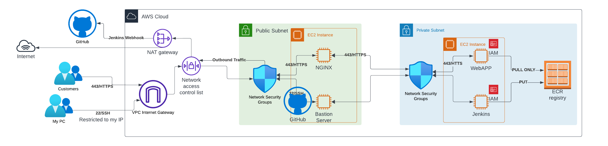

# DevSecOps Pipeline for a Secure Cloud-Hosted website/webapp

## Objective

The goal of this project is to implement a DevSecOps pipeline to build and secure a cloud environment for hosting a dymmy website/webapp. The website/webapp is designed to present simple content and must be accessible via a TLS connection only, ensuring that all data transmitted remains encrypted.
<br> **Will use self-sign cert**

<br>**Unfortunately, in the current setup, I will not be utilizing an Application Load Balancer (ALB) combined with AWS WAF  due to the cost implications :(((**

## Short Description

This repository contains the infrastructure as code (IaC) scripts, ansible scripts and web application code with CI/CD pipeline configurations necessary to deploy a secure and resilient cloud-hosted website/webapp. 

## DevSecOps Orientation

The project demonstrates a commitment to DevSecOps principles by automating the integration of security at every phase of the software development lifecycle. From provisioning AWS cloud resources using Terraform to enforcing secure coding practices and implementing a robust CI/CD pipeline with Jenkins, every component is designed to contribute to a secure, automated, and efficient workflow. (As I see it :) 

## Architecture Diagram



## Project Tree

```
.
├── README.md
├── ansible-aws-devsecops
│   ├── default.conf
│   ├── inventory.ini
│   ├── main.yml
│   ├── pre-flight.yml
│   ├── secure_servers.yml
│   ├── setup-jenkins_trivy.yml
│   └── setup_nginx.yml
├── cert
│   ├── miranda.com.crt
│   └── miranda.com.key
├── diagram.png
├── terraform-aws-devsecops
│   ├── ec2-instances.tf
│   ├── ecr-endpoints.tf
│   ├── iam.tf
│   ├── nacls.tf
│   ├── nat.tf
│   ├── outputs.tf
│   ├── plan.tfplan
│   ├── provider.tf
│   ├── routing.tf
│   ├── security-groups.tf
│   ├── subnets.tf
│   ├── terraform.tfstate
│   ├── terraform.tfstate.backup
│   ├── variables.tf
│   └── vpc.tf
└── webapp-aws-devsecops
    ├── Dockerfile
    ├── Jenkinsfile
    ├── app.py
    ├── docker-compose.yml
    └── requirements.txt

```

## Prerequisites

- AWS Account
- Terraform installed with AWS module
- Ansible installed
- Docker installed
- Jenkins with access to GitHub (for webhooks)
- Trivy for vuln analysis
- Common sense and a lot of beers :) 

# Infrastructure Design

## VPC and Subnet Layout Overview
- **VPC (`vpc.tf`)**: Establishes an isolated network environment within AWS, encapsulating all project resources.
- **Public Subnet (`subnets.tf`)**: Allocated for resources that need direct internet access, such as bastion host on port 22 (for testing purpose from my home IP), Nginx server on port 443 or NAT Gateway.
- **Private Subnet (`subnets.tf`)**: Reserved for backend services like Jenkins and web application server, preventing direct exposure to the public internet and enhancing security.

### Jenkins and Application Server (`ec2-instances.tf`)
- **Jenkins Server**: Situated within the private subnet to facilitate secure automation without direct internet exposure.
- **Web Application Servers**: Also positioned in the private subnet to protect them from direct public access and to maintain security.

### Nginx Reverse Proxy Server (`ec2-instances.tf`)
- **Nginx Server**: Configured with a security group to permit inbound HTTPS traffic on port 443 with the Self-sign cert., functioning as the entry point for internet traffic to the web application server.

### Bastion Server (`ec2-instances.tf`)
- **Bastion**: Provides a secure entry point for administrative tasks.
(There are ways to impement management access like VPN+MFA or similar)

## Security Groups Overview (`security-groups.tf`)

### Nginx Security Group (`nginx_sg`)
- **Purpose**: Serves as the firewall for the Nginx server, which acts as a reverse proxy.
- **Ingress Rules**:
  - HTTPS (Port 443): Open to the world, allowing secure web traffic to reach the application.
  - SSH (Port 22): Restricted to connections from the Bastion Host only, used for secure administrative access.
- **Egress Rules**:
  - Allows all outbound traffic, enabling the Nginx server to communicate with external services as needed.

### Web Application Security Group (`web_app_sg`)
- **Purpose**: Protects the web application servers, ensuring they can only be accessed through defined paths.
- **Ingress Rules**:
  - HTTP (Port 80): Permits traffic only from the Nginx server, ensuring all external requests are proxied securely.
  - SSH (Port 22): Allows secure shell access from Jenkins for deployment purposes and the Bastion Host for management.
- **Egress Rules**:
  - Permits all outbound traffic to allow the web application to interact with external services or databases.

### Jenkins Security Group (`jenkins_sg`)
- **Purpose**: Encapsulates the Jenkins CI/CD pipeline server, regulating access to support build and deployment activities securely.
- **Ingress Rules**:
  - SSH (Port 22) and HTTP (Port 8080): Access is strictly limited to the Bastion Host, safeguarding the Jenkins interface and shell access.
- **Egress Rules** :
  - Unrestricted outbound traffic to the NAT GW is essential for Jenkins to fetch code from repositories and download necessary build tools or dependencies and plugins.

### Bastion Host Security Group (`bastion_sg`)
- **Purpose**: Facilitates a secure jump point for accessing the internal network, crucial for administrative tasks.
- **Ingress Rules**:
  - SSH (Port 22): Narrowly allows connections from a specified IP address, providing a secure entry point for administrators.
- **Egress Rules**:
  - Allows outbound connections to manage and interact with other infrastructure components.

## IAM Configuration Overview (`iam.tf`)

### Web Application Server IAM Role
- **Role Name**: `web_app_role`
- **Purpose**: Grants the web application servers running on EC2 instances the necessary permissions to assume the role, allowing actions specified in attached policies.
- **Instance Profile**: `web_app_profile` binds this role to EC2 instances, enabling them to adopt the permissions associated with the role.

### Jenkins Server IAM Role
- **Role Name**: `jenkins_role`
- **Purpose**: Allows the Jenkins server to authenticate to Amazon ECR and manage Docker images as part of the CI/CD process, including pushing new images and updating existing ones.
- **Policies Attached**: 
  - `jenkins_policy` defines permissions for Jenkins to manage EC2 instances and interact with ECR repositories, including pulling and pushing Docker images.
- **Instance Profile**: `jenkins_profile` is tailored to provide Jenkins with the capabilities necessary for interacting with Amazon ECR.

### IAM Policies
- **Jenkins Server Policy (`jenkins_policy`)**: Specifies actions Jenkins can perform, for managing Docker images in ECR.
- **ECR Read Access Policy (`ecr_read_policy`)**: Grants web application servers read-only access to ECR repositories, ensuring they can pull necessary Docker images for deployment.

### Policy Attachments
- **Jenkins Server**: `jenkins_attach` links the `jenkins_policy` to the `jenkins_role`, effectively applying the policy’s permissions to Jenkins servers.
- **Web Application Server ECR Read Access**: `web_app_ecr_read_policy_attachment` attaches the `ecr_read_policy` to the `web_app_role`, granting the web application servers the required access to ECR.

___

### ECR Endpoints and Secure Image Retrieval
- **ECR Endpoints (`ecr-endpoints.tf`)**: Enable secure Docker image retrieval from AWS ECR by Jenkins and application servers within the private subnet, mitigating the risk of exposing them to public networks.

___

## AWS Network Configurations (`routing.tf`), NAT Gateway (`nat.tf`) and NACLs (`nacls.tf`)

### NAT Gateway and Outbound Internet Access
- **NAT Gateway (`nat.tf`)**: Facilitates outbound internet connectivity for instances in the private subnet for updates and patching while preventing any direct inbound traffic, preserving the integrity and security of the servers.

### Public Route Table
- **Route**: Configured to direct all outbound traffic (`0.0.0.0/0`) to the Internet Gateway (`aws_internet_gateway.igw`), enabling internet access for resources in the associated subnet.
- **Association**: The public route table is associated with a specific public subnet (`aws_subnet.public_subnet`), designating it as part of the publicly accessible portion of our network architecture.

### Private Route Table
- **Route**: Outbound traffic from the private subnet is directed to the NAT Gateway (`aws_nat_gateway.nat`), allowing secure internet access while keeping the subnet private.
- **Association**: This route table is specifically associated with a private subnet (`aws_subnet.private_subnet`), ensuring that the resources within this subnet maintain their private nature while still being able to initiate outbound connections.


### Public Subnet NACL Configuration

- **HTTPS Inbound**: Allows inbound traffic on TCP port 443 (HTTPS) from any source, enabling secure web access to our services.
- **SSH Inbound**: Permits SSH access (port 22) from trusted sources, facilitating secure administration of resources within the public subnet.
- **All Outbound**: Allows all outbound traffic from resources within the public subnet, ensuring they can initiate connections to the internet or other AWS services as required.

### Private Subnet NACL Configuration

- **SSH Inbound**: Allows SSH access (port 22) from the public subnet, ensuring administrators can securely manage private resources.
- **All Outbound**: Permits all outbound traffic, allowing responses to inbound requests and necessary external communications from resources within the private subnet, while still preventing direct inbound internet access.

## Jenkins CI/CD Pipeline Overview

### Ansible Playbooks Description

### Pipeline Stages

- **Checkout Code**: The pipeline initiates by checking out the latest version of the source code, ensuring that all actions are based on the most current codebase.

- **Build Docker Image**: This stage builds a Docker image containing the web application, tagged as 'latest', preparing it for both security scanning and deployment.

- **Trivy Vulnerability Scan**: Prioritizing security, we use Trivy to scan the newly built Docker image for known vulnerabilities. If vulnerabilities are detected, the pipeline is halted, a Slack notification is sent, and the build fails, preventing the deployment of vulnerable code.

- **Push to ECR**: Post security validation, the Docker image is pushed to Amazon Elastic Container Registry (ECR), using AWS credentials for secure authentication.

- **Deploy to Web Application Server**: The deployment stage transfers the `docker-compose.yml` to the web application server and starts or updates the application using `docker-compose up`, secured with SSH credentials stored in Jenkins.

- **Notification**: Upon completion, the pipeline notifies a specified Slack channel about the build outcome, ensuring immediate awareness and action if needed.

### Security and Compliance

- Integrating Trivy scans directly into the pipeline embodies the DevSecOps principle of "shifting left", addressing security issues early in the development lifecycle.

- Best practices for credential management are employed, securely fetching necessary credentials at runtime, including AWS credentials for ECR and SSH credentials for server deployment.

### Conclusion

This Jenkins CI/CD pipeline is a key component of our DevSecOps workflow, automating the journey from code commit to deployment while embedding essential security checks. By enforcing a build failure upon detecting vulnerabilities, we maintain high security standards, underscoring our dedication to secure, reliable software development.

Each playbook and configuration file plays a vital role in establishing a secure and automated infrastructure, aligning with the DevSecOps principles. Here's a closer look at their functions:

### `default.conf`
- **Description**: Configures an Nginx server for secure HTTPS communication on port 443. It specifies SSL certificates, enforces strong SSL protocols, and defines secure ciphers, emphasizing the importance of encrypted web traffic. 
<br> **Self sign certificate**
- **DevSecOps Impact**: Ensures all web traffic is securely encrypted, meeting security best practices for web applications.

### `inventory.ini`
- **Description**: Defines host groups along with their IP addresses, organizing the web application, Jenkins, Nginx, and bastion hosts for precise playbook execution.
- **DevSecOps Impact**: Facilitates targeted automation and configuration, crucial for managing complex cloud environments securely and efficiently.

### `main.yml`
- **Description**: Serves as the orchestration point for the deployment process, importing and executing other playbooks like `pre-flight.yml`, `secure_servers.yml`, `setup-nginx.yml`, and `setup-jenkins.yml` in a structured sequence.
- **DevSecOps Impact**: Coordinates the setup process to ensure a smooth, orderly deployment, embodying the automation aspect of DevSecOps.

### `pre-flight.yml`
- **Description**: Executes initial setup tasks across all servers, including installing common packages and setting up Docker on Nginx and Jenkins servers.
- **DevSecOps Impact**: Prepares the environment by ensuring that all servers start from a common security and configuration baseline.

### `secure_servers.yml`
- **Description**: Hardens server security by updating all packages, disabling root SSH login, and enforcing key-based SSH authentication.
- **DevSecOps Impact**: Critical for maintaining the security integrity of servers, ensuring they are protected against unauthorized access and vulnerabilities.

### `setup_nginx.yml`
- **Description**: Installs and configures the Nginx server, including Docker installation. It also adds users to the Docker group and ensures Docker service is running, preparing Nginx to act as a reverse proxy server.
- **DevSecOps Impact**: Plays a key role in access control and traffic management, contributing to the secure deployment of web applications.

### `setup-jenkins.yml`
- **Description**: Automates the deployment of Jenkins in a Docker container, including Docker installation and starting the Jenkins service.
- **DevSecOps Impact**: Facilitates continuous integration and delivery by providing a robust CI/CD pipeline, enabling automated builds, tests, and deployments.
- Required Jenkins Plugins:
    - Docker Plugins: For Docker-related operations in your pipeline.
        - Docker plugin
        - Docker pipeline plugin
    - SSH Agent Plugin: For the withCredentials step that involves SSH operations
    - Pipeline SCM Step: For SCM operations like checkout scm.
    - Pipeline Utility Steps: Utility steps for pipeline jobs can be useful in scripting within the pipeline.
- The Shared Library should be set up in Jenkins under "Manage Jenkins" > "Configure System" > "Global Pipeline Libraries".


## License

MIT

**Free Software, Hell Yeah!**
